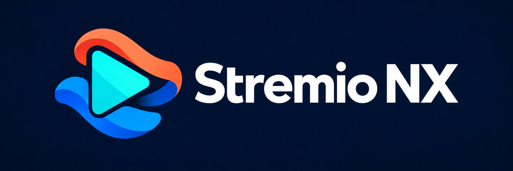

# Stremio NX

An independent video player for Nintendo Switch homebrew, compatible with Stremio add-ons.

Browse catalogs and play torrents or direct HTTP links, including compatible debrid streams. Supports subtitles, audio-track selection, add-on management, controller input and touch.

## Install

1. Download `stremio-nx.nro` from [Releases](https://github.com/jrgf/stremio-nx/releases), under Assets.
2. Copy `stremio-nx.nro` to `/switch/` on your SD card.
3. Open the Homebrew Menu through title override by holding R while launching a game, then start Stremio NX.

## Controls

| Button | Action |
| --- | --- |
| D-pad | Navigate; Left/Right seeks during playback |
| A | Select; pause or resume playback |
| B | Back; stop playback |
| L/R | Switch sections |
| Y | Search; open audio/subtitle selection during playback |
| + | Exit |

## Add-ons

Open Add-ons and press Y to enter a manifest URL. For add-ons that need browser setup, open the displayed address on a phone connected to the same Wi-Fi, enter the pairing code, and paste the configured install link.

Direct video links must support byte ranges. HLS, DASH and DRM playback are not supported. WatchHub links open the provider on your phone.

## License

Original project code uses [GPL-3.0-or-later](LICENSE). Dependencies retain their [own licenses](THIRD_PARTY_NOTICES.txt). Not affiliated with Stremio or Nintendo.

[Build from source](docs/building.md) · [License review](LICENSE_REVIEW.md)
